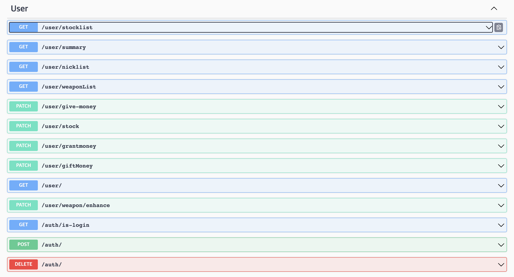

# DiscordGambleBot2

``` text plain
💡 디스코드 봇을 사용하여 채널에서 여러 게임을 즐길 수 있는 봇
```

-  **디스코드 봇 기반**으로 만들어 졌으며, 게임을 즐길 때 사용자 편의를 위해 웹페이지 제작

- Web Link: [https://puddingii.github.io/discordGambleBotFront](https://puddingii.github.io/discordGambleBotFront)

## 🤖 Discord Bot Command

| 이름 | 커맨드 타입 | Main or Sub | 설명 |
| --- | --- | --- | --- |
| 무기강화 | Slash | Main | 특정 무기를 강화시키기 위해 먼저 호출해야 하는 커맨드 |
| 무기강화 | Button,Select | Sub | 1. Select Box로 강화할 무기를 픽 2. Button을 통해 강화버튼 클릭
| 무기내역 | Slash | Main | 성공,실패 등의 무기 정보 출력 |
| 무기확률 | Slash | Main | 강화확률,비용을 리스트로 출력 |
| 주식풀매수 | Slash | Main | 가지고 있는 모든 돈으로 사용자가 입력한 이름의 주식 매수 |
| 주식매수 | Slash | Main | 사용자가 입력한 이름의 주식을 입력한 갯수만큼 매수 |
| 주식흐름 | Slash | Main | 현재 주식시장의 흐름이 어떤지(나쁜지 좋은지) |
| 주식리스트 | Slash | Main | 매수할 수 있는 모든 주식정보 출력 |
| 내주식 | Slash | Main | 내가 보유하고 있는 주식 출력 |
| 주식풀매도 | Slash | Main | 사용자가 입력한 이름의 주식을 모두 매도(보유한 주식 전부 매도) |
| 주식매도 | Slash | Main | 사용자가 입력한 이름의 주식을 입력한 갯수만큼 매도 |
| 차트보기 | Slash | Main | 사용자가 입력한 이름의 주식에 대한 히스토리 차트 |
| 유저등록 | Slash | Main | 해당 봇을 이용하기 위한 등록 |
| 비밀번호발급 | Slash | Main | 웹에서 로그인하기 위한 비밀번호 발급 |
| 돈기부 | Slash | Main | 입력한 유저에게 입력한 수만큼 기부 |
| 보조금받기 | Slash | Main | 자동으로 쌓이는 보조금 통장(공용 지갑)에 있는 모든 돈 가져오기 |
| 내돈 | Slash | Main | 내가 보유하고 있는 돈 출력 |
| 랭킹 | Slash | Main | 보유한 주식 + 보유하고 있는 돈 출력 |
| 돈선물모두받기 | Slash | Main | 받은 선물 중 돈에 해당하는 선물들 모두 받기 |
| 보조금누적액 | Slash | Main | 보조금 통장(공용 지갑)에 쌓여있는 금액 출력 |
| 어드민 | Slash | Main | 어드민 전용 커맨드 |
| 어드민 | Select,Modal | Sub | 1. Select Box로 컨트롤 하고 싶은 메뉴 클릭 2. Modal 및 Select Box로 컨트롤

## 🌐 REST API

### 1. User API



### 2. Stock API


### 3. Weapon API


## 🤔 File Structure

```
├── README.md
├── tsconfig.json
├── package.json
├── Dockerfile
├── .github
│   └── workflows
│       └── main.yml : Github Actions를 위한 파일
└── src
    ├── app.ts
    ├── bot : Bot 폴더
    │   ├── commands : 커멘드 모음(Main Command - Sub Command)
    │   ├── events : Event type에 따른 처리
    │   ├── middlewares : Bot Middleware
    │   └── deploy-commands.ts : Slash Command를 Discord 서버에 배포
    ├── common : Bot, Web 공용 폴더
    │   ├── controller : Bot, Web에서 사용하는 컨트롤러
    │   ├── game : Data Transfer Object
    │   ├── model : Schema & ORM Functions 정의
    │   ├── services : Service 로직
    │   └── util : 유틸관련 Class
    ├── config : Secret Key Object
    ├── cron : Batch 설정 및 함수 정의
    ├── express : Express 폴더
    │   ├── middlewares : Express Middleware
    │   ├── passport : Passport 관련 폴더(Auth)
    │   ├── routes : REST API 라우터
    │   └── swagger : Development 환경에서 API 문서
    ├── interfaces : Interface 정의 폴더(Class 및 Variable 등의 type 정의)
    ├── loaders : [DB, Bot, Express, Cron] Init
    ├── settings : Dependency Injection 관련 셋팅
    └── types : Library 타입 커스텀
```


## 📋 TODO

1. 프론트에서 필요한 REST API 제작
    - 주식차트 관련 API 필요
2. 성능 개선
    - Web Page에서 API를 호출할 때 생각보다 많은 시간이 걸림(1~2초)
